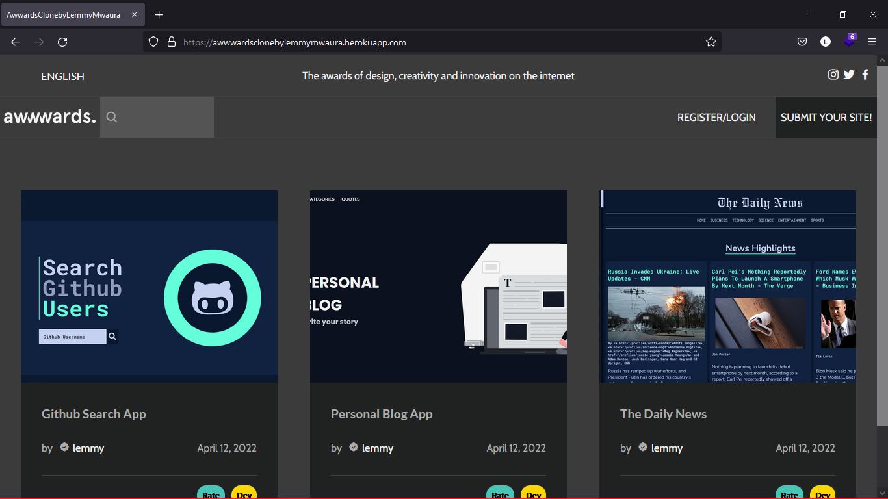

# Awwards-clone
Awwards Clone. Submit your Project and have it be reviewed.
Mini django project

## Table of contents
  - [Screenshot](#screenshot)
  - [Project Visual](#Screenshot)
  - [Project Description](#Project-description) 
  - [Built with](#built-with)
  - [Usage](#Getting-Started)
  - [License & Copywright Information](#License-and-Copywright-Information)
  - [Author](#author)

---
___

### Screenshot

___
---
### Introduction
Awwards Clone.
A basic clone of the famous Awwards website. Performs user authentication, stores user data in a database and Images are stored in a CDN.

The goal of this project is to do a bit of practice on django. It allows users to submit their projects for review or add reviews to other user's projects.  

Project is written with django 4.0.3 and python 3 in mind.

---
___

### BDD
 #### Context
  Given that a user creates an account.
 #### Event
  When the user logs in or interacts with the page
#### Outcomes
  Then a user should be able to view existing projects.\
  The user should also be able to add a review to any project.\
  The user should also be able to submit their own projects for review.\
  Each review should be in the range of 1 to 10 and is grouped into 4 categories.\
  The average rate should automatically be calculated and dispalayed for each review\
  When the user tries to query the data(from an Project's details e.g title or a user's name) only relevant posts that much the specific query should be displayed.

* [x] A user can create an account and login.
* [x] Users can add a review to a project.
* [x] Users can submit their own projects for review.
* [x] The average rate of a review is automatically calculated.
* [x] Each user has a user profile.
* [x] Each profile filters that specific users details.
* [x] Data can be queried using the search feature.

---
___
### Built with / Technologies Used

- Python
    - Django
    - PostgresSQL
    - Cloudinary
---
___

# Getting Started

First clone the repository from Github and switch to the new directory:

    $ git clone git@github.com:LemmyMwaura/Awwards-clone.git
    $ cd Awwards-clone
    
Activate the virtual environment for the project.

     $ pipenv shell
    
Install project dependencies:

    $ pipenv install
    
    
Then simply apply the migrations:

    $ python manage.py migrate
    

You can now run the development server:

    $ python manage.py runserver

 

---
___

## License and Copywright Information
(c) Stephen Lemmy Mwaura, Software Engineer.

Licensed under the [MIT License](LISENCE)

---
___
## Author 
Hi there, I'm Lemmy and i love to code. Connect With me:

- 🎱 Github - [@lemmyMwaura](https://github.com/LemmyMwaura)

---
___

